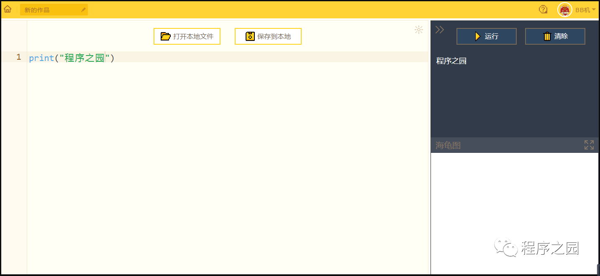

### 难度：1☆                语言：Python ###

今天我们要学习的是最简单的**Python函数**——Print 

首先给大家介绍最基本的2种数据类型：
      一个是字符串类型；
     一个是整数型。
相信变量大家不陌生吧，（→去百度→）
变量既可以是整数型，也可以是字符串类型，像“1、2”一样的数字就是整数型，而像“程序之园”这样的信息则是字符串型。
       打开Python，*输入*：
                                    print("程序之园")
       运行脚本，会在信息栏中返回：
                                           程序之园

那如果我们要调用整数型的变量，可以这样：
a = 5
print(a)
注意，a是不需要加引号的
而这个a = 5是赋值变量
所以返回栏中是这样：

返回栏是5
这里需要掌握“”引号的区别
整数型，不加引号
字符串，加引号
否则就会这样：

因为你命令电脑的是输出“a”
所以电脑很听话的把a给了你……

或者是这样：

